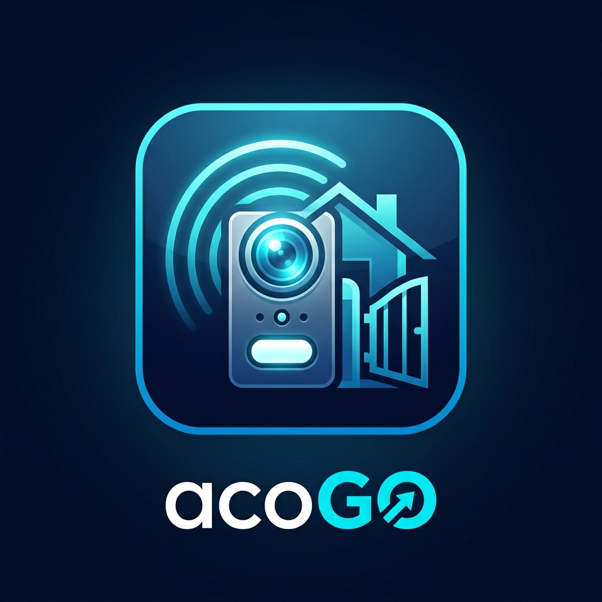

# acoGO! 2.0 — Home Assistant Integration

[](https://github.com/hacs/integration)
[](https://github.com/xpoh697/acogo/releases)
[](LICENSE)

<p align="center">
  
</p>

Интеграция для систем умных домофонов и модулей **ACO (acoGO! 2.0)** в **Home Assistant**.

Разработано на основе полного реверс-инжиниринга официального мобильного приложения `pl.aco.acogo` (v1.9.0), облачного API `api.aco.com.pl` и прямого взаимодействия с AWS Kinesis Video Streams WebRTC.

---

## Возможности

- 🚪 **Управление дверью (калитка)**: Надежное импульсное открытие электрозамка (`f2Open`).
- 🚗 **Управление въездными воротами**: Открытие въездных ворот или шлагбаума (`ezOpen`).
- 🛡️ **Защита физической линии домофона**: Реализована безопасная последовательность перехвата и освобождения линии (`receiveCall` ➔ задержка ➔ `open` ➔ `endCall`) с защитой от состояния гонки через `asyncio.Lock` для каждого устройства.
- 🔔 **Детекция звонков**: Мгновенный бинарный сенсор входящего вызова (`binary_sensor.*_incoming_call_line_active`) для запуска автоматизаций (оповещения в Telegram, умные колонки, подсветка).
- 📶 **Мониторинг состояния**: Сенсор доступности панели (Online / Offline), версии ПО и прошивки.
- 📺 **Живое WebRTC видео (Lovelace Card)**: Встроенная кастомная карточка `acogo-webrtc-card` с прямой P2P-трансляцией 30 FPS через браузерный стек AWS Kinesis Video Streams с околонулевой задержкой, кнопками управления калиткой/воротами и бейджами статуса.
- 📸 **Сервис создания снимков**: Специализированная служба `acogo.capture_snapshot` для автоматизаций Home Assistant (захват WebRTC-кадра напрямую в `/config/www/` с отказоустойчивой fallback-карточкой при задержках сотовой связи).
- ⚙️ **Удобная настройка через UI**: Авторизация по учетным данным портала myAco / acoGO с автоматической регистрацией защищенной сессии устройства.

---

## Установка

### Вариант 1: Установка через HACS (рекомендуется)

1. Убедитесь, что у вас установлен [HACS](https://hacs.xyz/).
2. В интерфейсе Home Assistant перейдите в **HACS** ➔ **Интеграции**.
3. В правом верхнем углу нажмите меню с тремя точками ➔ **Пользовательские репозитории** (Custom repositories).
4. Добавьте URL репозитория `https://github.com/xpoh697/acogo`, выберите категорию **Интеграция** (Integration) и нажмите **Добавить**.
5. Найдите в поиске **acoGO! Intercom** и нажмите **Загрузить** (Download).
6. Перезагрузите Home Assistant.

### Вариант 2: Ручная установка

1. Скачайте архив репозитория.
2. Скопируйте папку `custom_components/acogo` в каталог `custom_components` вашей конфигурации Home Assistant (путь: `/config/custom_components/acogo`).
3. Перезагрузите Home Assistant.

---

## Настройка интеграции

1. В Home Assistant перейдите в **Настройки** ➔ **Устройства и службы** ➔ **Добавить интеграцию**.
2. Введите в поиске **acoGO! Intercom**.
3. В диалоговом окне укажите:
   - **Email / Имя пользователя** от аккаунта acoGO! / myAco.
   - **Пароль**.
4. Нажмите **Отправить**. Интеграция автоматически зарегистрирует защищенную сессию устройства в облаке ACO и создаст все сущности для обнаруженных вызывных панелей.

---

## Создаваемые сущности

Для каждой вызывной панели создаются следующие сущности:

| Домен | Сущность | Описание |
|---|---|---|
| `lock` | `Door Lock` | Замок двери / калитки |
| `lock` | `Gate (F2)` | Замок ворот / шлагбаума |
| `button` | `Open Door` | Импульсная кнопка открытия калитки |
| `button` | `Open Gate` | Импульсная кнопка открытия ворот |
| `binary_sensor` | `Status` | Доступность панели в облаке (Online / Offline) |
| `binary_sensor` | `Incoming Call / Line Active` | Индикатор входящего звонка / активности линии |

> [!NOTE]
> В версиях **1.0.9+** стандартная сущность `camera` была удалена. Физические панели acoGO! не имеют локального веб-сервера (JPEG/RTSP) и передают видео исключительно через AWS Kinesis Video Streams WebRTC. Для просмотра живого видеопотока используется кастомная карточка `acogo-webrtc-card`, а для автоматизаций — служба `acogo.capture_snapshot`.

---

## Карточка для дашборда (Lovelace Card)

Интеграция поставляется со встроенной карточкой **`acogo-webrtc-card`**, обеспечивающей прямое воспроизведение живого видеоряда с вызывной панели.

### Подключение ресурса Lovelace
Ресурс регистрируется автоматически при запуске интеграции. Если вы настраиваете дашборды вручную через YAML или хотите обновить ресурс, укажите:
- **URL**: `/api/acogo/static/acogo-webrtc-card.js?v=1.1.0`
- **Тип**: `JavaScript модуль`

### Пример конфигурации карточки:
```yaml
type: custom:acogo-webrtc-card
title: Домофон (Калитка)
camera_entity: binary_sensor.ulitsa_acogo_julianow_status
door_button: button.ulitsa_acogo_julianow_open_door
gate_button: button.ulitsa_acogo_julianow_open_gate
call_sensor: binary_sensor.ulitsa_acogo_julianow_incoming_call_line_active
```

**Особенности карточки:**
- Нативный плеер HTML5 WebRTC (30 FPS, аудио/видео).
- Встроенные кнопки мгновенного импульсного открытия калитки и ворот.
- Индикатор входящего звонка в реальном времени.
- Автоматическое завершение WebRTC-сессии при уходе со страницы или закрытии карточки (защита от исчерпания облачных квот и освобождение домофонной линии).

---

## Службы (Services)

Интеграция предоставляет набор специализированных служб:

### `acogo.capture_snapshot`
Делает снимок с вызывной панели домофона и сохраняет его на диск в каталог `/config/www/`.

```yaml
action: acogo.capture_snapshot
data:
  filename: /config/www/doorbell_snapshot.jpg
  timeout: 10
```

- **`filename`** *(опционально)*: Полный путь к файлу. Рекомендуется сохранять в `/config/www/`, чтобы файл был доступен веб-серверу Home Assistant и Telegram-боту. По умолчанию: `/config/www/doorbell_snapshot.jpg`.
- **`timeout`** *(опционально)*: Таймаут ожидания видеокадра WebRTC в секундах (по умолчанию `12`).
- **Отказоустойчивость (Fail-Safe)**: Если сотовая связь домофона испытывает задержки и I-frame не получен в течение заданного таймаута, сервис автоматически генерирует информационную карточку 1280×720 со штампом времени звонка и именем панели. Ваш Telegram-бот **всегда получит валидное изображение** и не упадет с ошибкой "файл не найден".

### `acogo.start_webrtc_stream`
Инициирует сессию видеотрансляции вызывной панели в облаке ACO / AWS KVS.

### `acogo.stop_webrtc_stream`
Завершает активную сессию видеотрансляции и освобождает физическую линию домофона.

---

## Примеры автоматизаций

### 1. Отправка фото звонящего в Telegram с кнопками открытия

При звонке в домофон автоматизация вызывает службу `acogo.capture_snapshot` и отправляет полученный снимок в Telegram с инлайн-кнопками открытия двери и ворот:

```yaml
- id: "acogo_doorbell_telegram_notify"
  alias: "Домофон: Фото звонящего в Telegram"
  description: "При звонке в домофон делает снимок и отправляет в Telegram с кнопками открытия"
  triggers:
    - trigger: state
      entity_id:
        - binary_sensor.ulitsa_acogo_julianow_incoming_call_line_active  # Замените на entity_id вашей панели
      to: "on"
  mode: single
  actions:
    # 1. Формируем уникальный путь файла (защита от кэширования в Telegram)
    - variables:
        snapshot_file: >-
          /config/www/aco_bell_{{ now().strftime('%Y%m%d_%H%M%S') }}.jpg

    # 2. Захват снимка через WebRTC-сервис acogo
    - action: acogo.capture_snapshot
      data:
        filename: "{{ snapshot_file }}"
        timeout: 10

    # 3. Отправка фото в Telegram с кнопками
    - action: telegram_bot.send_photo
      data:
        file: "{{ snapshot_file }}"
        caption: >-
          🔔 *Звонок в домофон!* 🕒 Время: {{ now().strftime('%H:%M:%S') }}
        inline_keyboard:
          - "🚪 Открыть дверь:/aco_open_door, 🚧 Открыть ворота:/aco_open_gate"
```

---

### 2. Обработка нажатия кнопок в Telegram (с защитой по User ID)

```yaml
- id: "acogo_telegram_action_handler"
  alias: "Домофон: Обработка команд из Telegram"
  description: "Открытие двери или ворот по нажатию кнопок под фото в Telegram"
  triggers:
    - trigger: event
      event_type: telegram_callback
      event_data:
        data: /aco_open_door
      id: open_door
    - trigger: event
      event_type: telegram_callback
      event_data:
        data: /aco_open_gate
      id: open_gate
  conditions:
    # Защита: разрешено только доверенным Telegram User ID (опционально)
    - condition: template
      value_template: >-
        {{ trigger.event.data.user_id in [123456789, 987654321] }}
      enabled: false
  actions:
    - choose:
        # Открытие двери (калитка)
        - conditions:
            - condition: trigger
              id: open_door
          sequence:
            - action: button.press
              target:
                entity_id: button.ulitsa_acogo_julianow_open_door
            - action: telegram_bot.answer_callback_query
              data:
                callback_query_id: "{{ trigger.event.data.id }}"
                message: "✅ Дверь открыта!"
                show_alert: false

        # Открытие въездных ворот
        - conditions:
            - condition: trigger
              id: open_gate
          sequence:
            - action: button.press
              target:
                entity_id: button.ulitsa_acogo_julianow_open_gate
            - action: telegram_bot.answer_callback_query
              data:
                callback_query_id: "{{ trigger.event.data.id }}"
                message: "✅ Ворота открываются!"
                show_alert: false
  mode: parallel
```

---

### 3. Автоматическая очистка старых снимков звонков (Опционально)

Чтобы накопитель Home Assistant не заполнялся архивными снимками, можно добавить автоматическую очистку файлов старше 7 дней:

```yaml
- id: "acogo_cleanup_snapshots"
  alias: "Домофон: Очистка старых фото звонков"
  description: "Удаляет снимки звонков старше 7 дней из папки /config/www"
  triggers:
    - trigger: time
      at: "04:00:00"
  actions:
    - action: shell_command.purge_old_aco_bell_photos  # В configuration.yaml: find /config/www -name 'aco_bell_*.jpg' -mtime +7 -delete
  mode: single
```

---

## Лицензия

Проект распространяется под лицензией MIT.
